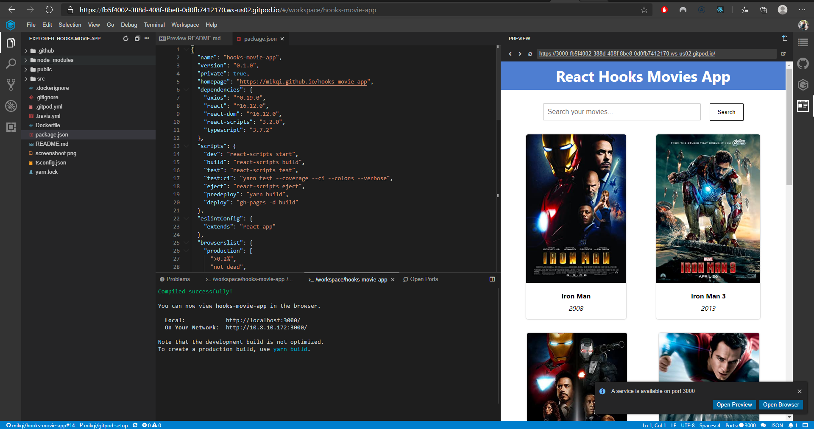

 

## Movie Search App

> This project using react hooks, react context, hook reducer and Typescript

### How to Run

#### Local Machine
- Make sure you already installed [NodeJS](https://nodejs.org/) and [Yarn](https://yarnpkg.com/)
- `yarn` to install dependencies
- `yarn dev` to run after all dependencies installed

#### Using Gitpod
- Click 
- You can experiment this PR on Gitpod

